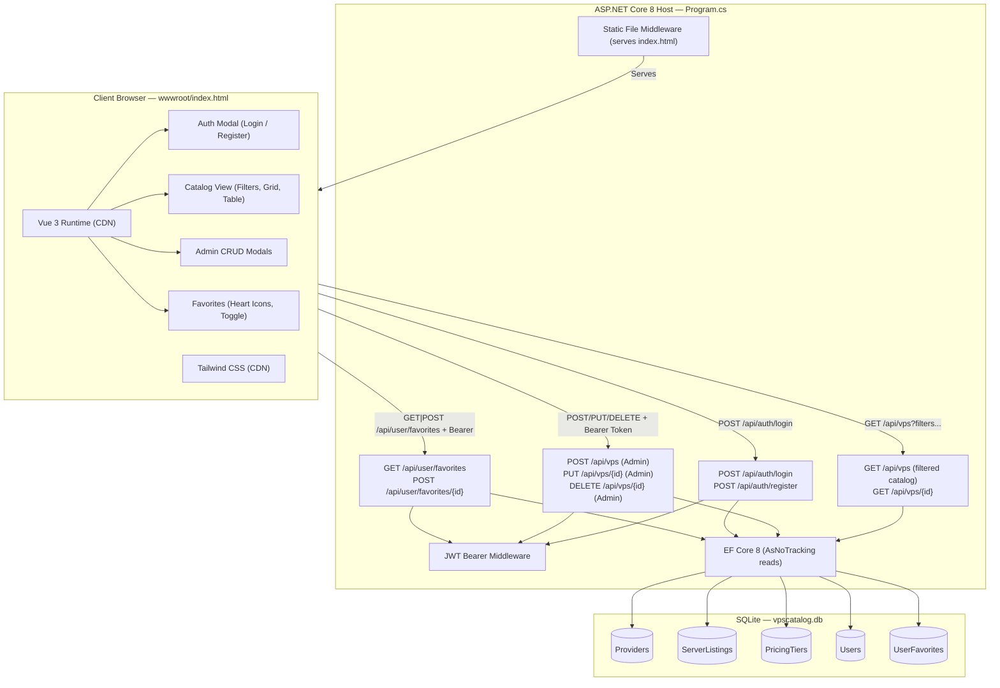
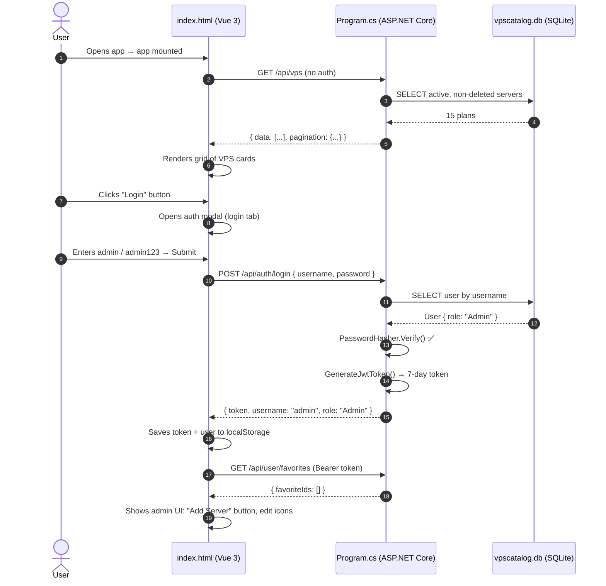
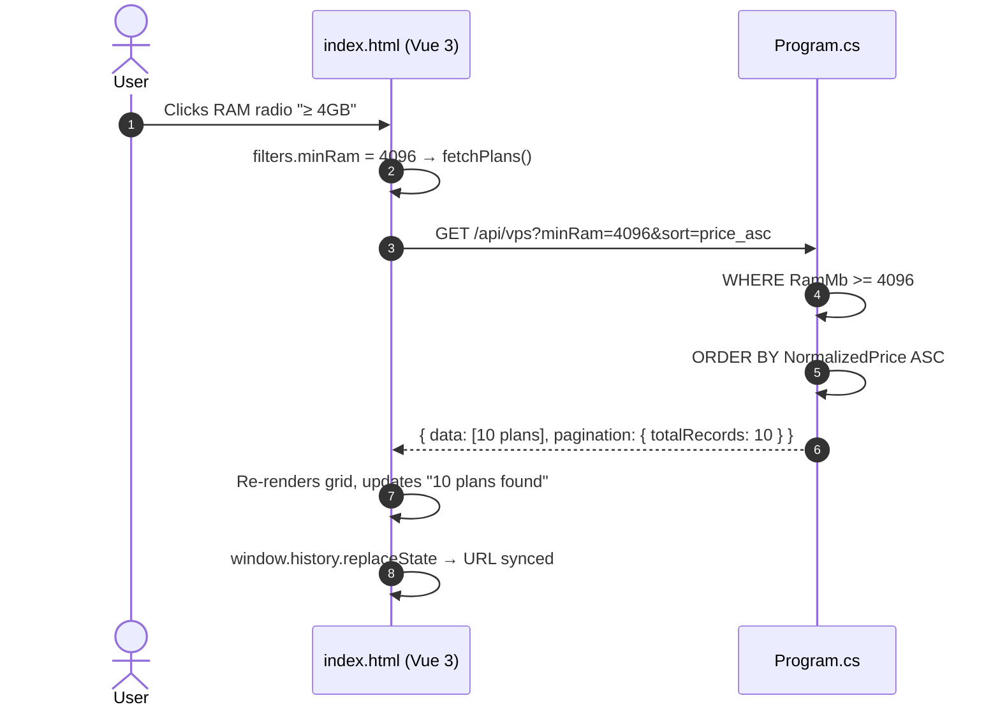
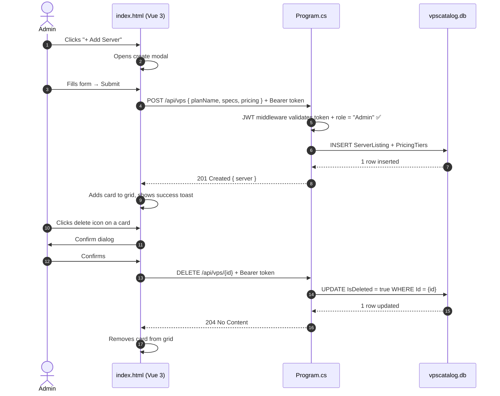

# Architectural Plan: VPS Catalog Application

| Attribute | Value |
| :--- | :--- |
| **Plan ID** | `PLAN-001` |
| **Feature Reference** | [SPEC-001: VPS Catalog](../specs/vps-catalog.md) |
| **Constitution** | [CONST-001: Project Constitution](../memory/constitution.md) |
| **Architecture Style** | Monolithic Single-File Backend + Single-File Reactive Frontend |
| **Backend Technology** | C# ASP.NET Core 8 Minimal APIs, EF Core 8 SQLite, JWT Bearer Auth |
| **Frontend Technology** | Single `wwwroot/index.html` — Vue.js 3 (CDN) + Tailwind CSS (CDN) |
| **Status** | `Implemented — v1.0.0` |
| **Last Updated** | 2026-10-03 |

---

## 1. System Architecture Overview

The system uses a lightweight, ultra-portable **two-file distribution model** with no build tooling required:

1. **Backend**: A single C# file (`Program.cs`, ~1,500 lines) containing all domain models, `DbContext`, seed data, JWT authentication, business logic, and ASP.NET Core 8 Minimal API endpoint handlers, backed by an embedded SQLite database (`vpscatalog.db`).
2. **Frontend**: A single `wwwroot/index.html` file powered by Vue 3 and Tailwind CSS via CDN — no Node.js, no build step.



---

## 2. Directory & File Structure

```text
d:\Internship\VpsMonitor\
├── .specify/
│   ├── memory/
│   │   └── constitution.md       ← Non-negotiable architectural rules (CONST-001)
│   ├── plans/
│   │   └── vps-plan.md           ← This document (PLAN-001)
│   ├── specs/
│   │   └── vps-catalog.md        ← Feature specification (SPEC-001)
│   └── tasks/
│       └── tasks-01.md           ← Full development task checklist (TASKS-01)
├── VpsMonitor.csproj             ← .NET 8 Web SDK; RollForward=LatestMajor
├── Program.cs                    ← Single-file C# backend (~1,500 lines)
├── wwwroot/
│   └── index.html                ← Single-file Vue 3 + Tailwind CSS frontend
└── vpscatalog.db                 ← Auto-created SQLite database (runtime artifact)
```

---

## 3. Backend Architecture (`Program.cs`)

### 3.1 Project File (`VpsMonitor.csproj`)

```xml
<Project Sdk="Microsoft.NET.Sdk.Web">
  <PropertyGroup>
    <TargetFramework>net8.0</TargetFramework>
    <Nullable>enable</Nullable>
    <ImplicitUsings>enable</ImplicitUsings>
    <RollForward>LatestMajor</RollForward>  <!-- Allows running on .NET 10+ -->
  </PropertyGroup>
  <ItemGroup>
    <PackageReference Include="Microsoft.EntityFrameworkCore.Sqlite" Version="8.0.11" />
    <PackageReference Include="Microsoft.AspNetCore.Authentication.JwtBearer" Version="8.0.11" />
  </ItemGroup>
</Project>
```

---

### 3.2 Domain Entities & EF Core Schema

All five entities are defined directly in `Program.cs`:

| Entity | Key Fields | Notes |
| :--- | :--- | :--- |
| `Provider` | Id, Name, Slug, WebsiteUrl, LogoUrl, IsActive | Parent of `ServerListing` |
| `ServerListing` | Id, ProviderId, PlanName, Slug, VcpuCount, RamMb, StorageGb, StorageType, LocationsCsv, IsActive, **IsDeleted** | Global soft-delete query filter applied |
| `PricingTier` | Id, ServerListingId, BillingCycle, Amount, Currency, SetupFee, DiscountPercent, IsDefault | BillingCycle: `HOURLY`, `MONTHLY`, `QUARTERLY`, `ANNUALLY` |
| `User` | Id, Username, PasswordHash, Role, CreatedAt | Role: `"Admin"` or `"User"` |
| `UserFavorite` | Id, UserId, ServerListingId, CreatedAt | Unique index on `(UserId, ServerListingId)` |

**Soft-delete global filter** (prevents deleted servers from appearing in any query):
```csharp
modelBuilder.Entity<ServerListing>().HasQueryFilter(s => !s.IsDeleted);
```

---

### 3.3 Startup & Seeding

```csharp
using (var scope = app.Services.CreateScope())
{
    var db = scope.ServiceProvider.GetRequiredService<CatalogDbContext>();
    db.Database.EnsureCreated();        // Auto-creates schema — no migration files
    await DatabaseSeeder.SeedAsync(db); // Seeds users, providers, and VPS plans
}
```

**Seed data guaranteed on every fresh database:**
- Users: `admin / admin123` (Admin), `user / user123` (User)
- Providers: Hetzner Cloud, DigitalOcean, OVHcloud, Linode, Vultr
- Plans: 15 realistic VPS plans with hourly/monthly/annual pricing tiers

---

### 3.4 JWT Authentication

```
Configuration key: Jwt:Key (fallback hardcoded string)
Issuer:            CloudVpsCatalog
Audience:          CloudVpsCatalogUsers
Token lifetime:    7 days
Algorithm:         HMAC-SHA256
Claims:            NameIdentifier (UserId), Name (Username), Role
Password hashing:  PasswordHasher<User> from Microsoft.AspNetCore.Identity
```

Middleware registration order (non-negotiable per CONST-001):
```csharp
app.UseCors();
app.UseAuthentication();
app.UseAuthorization();
app.UseDefaultFiles();
app.UseStaticFiles();
```

---

### 3.5 Complete API Endpoint Reference

#### Public Endpoints (No Auth Required)

| Method | Route | Description |
| :--- | :--- | :--- |
| `POST` | `/api/auth/register` | Create new user account; returns JWT token |
| `POST` | `/api/auth/login` | Authenticate and receive JWT token |
| `GET` | `/api/vps` | Filtered, sorted, paginated VPS catalog |
| `GET` | `/api/vps/{id}` | Single VPS plan detail |
| `GET` | `/api/v1/servers` | Legacy alias → same as `GET /api/vps` |
| `GET` | `/api/v1/servers/{id}` | Legacy alias → same as `GET /api/vps/{id}` |

#### Protected Endpoints — Any Authenticated User (`[Authorize]`)

| Method | Route | Description |
| :--- | :--- | :--- |
| `GET` | `/api/user/favorites` | Get authenticated user's favorited plan IDs |
| `POST` | `/api/user/favorites/{id}` | Toggle favorite on/off for a plan |

#### Protected Endpoints — Admin Role Only (`[Authorize(Role = "Admin")]`)

| Method | Route | Description |
| :--- | :--- | :--- |
| `POST` | `/api/vps` | Create new VPS plan listing |
| `PUT` | `/api/vps/{id}` | Partial update existing plan + optional pricing replacement |
| `DELETE` | `/api/vps/{id}` | Soft-delete plan (sets `IsDeleted = true`) |
| `POST` | `/api/v1/servers` | Legacy alias → same as `POST /api/vps` |
| `PUT` | `/api/v1/servers/{id}` | Legacy alias → same as `PUT /api/vps/{id}` |
| `DELETE` | `/api/v1/servers/{id}` | Legacy alias → same as `DELETE /api/vps/{id}` |

---

### 3.6 `GET /api/vps` — All Query Parameters

| Parameter | Aliases | Type | Description |
| :--- | :--- | :--- | :--- |
| `q` | `search` | string | Full-text search on PlanName, CpuType, LocationsCsv, Provider.Name |
| `minPrice` | `min_price` | decimal | Minimum normalized monthly price |
| `maxPrice` | `max_price` | decimal | Maximum normalized monthly price |
| `billing` | `billing_cycle` | string | Filter by `HOURLY`, `MONTHLY`, `ANNUALLY` |
| `minRam` | `min_ram_mb` | int | Minimum RAM in MB (e.g., `4096` = 4 GB) |
| `minCpu` | `min_vcpu` | int | Minimum vCPU count |
| `storageType` | `storage_type` | string | `NVMe`, `SSD`, or `HDD` |
| `provider` | — | string | Provider name, slug, or GUID string |
| `provider_id` | — | Guid | Provider GUID directly |
| `region` | `location` | string | Country code (e.g., `DE`, `US`, `SG`) |
| `sort` | `sortBy` | string | `price_asc`, `price_desc`, `ram_desc`, `cpu_desc`, `newest` |
| `favoritesOnly` | — | bool | If `true` + authenticated: return only favorites |
| `page` | — | int | Page number (default: 1) |
| `limit` | — | int | Results per page (default: 12, max: 100) |

**Price Normalization Logic:**

$$\text{Normalized Monthly Price} = \begin{cases} \text{Amount} \times 730 & \text{if HOURLY} \\ \text{Amount} / 12 & \text{if ANNUALLY} \\ \text{Amount} / 3 & \text{if QUARTERLY} \\ \text{Amount} & \text{if MONTHLY} \end{cases}$$

**Response Shape:**
```json
{
  "data": [
    {
      "id": "uuid",
      "planName": "CPX21",
      "slug": "hetzner-cpx21",
      "provider": { "id": "uuid", "name": "Hetzner Cloud", "slug": "hetzner", "logoUrl": "...", "websiteUrl": "..." },
      "specs": { "vcpu": 3, "cpuType": "AMD EPYC", "ramMb": 4096, "storageGb": 80, "storageType": "NVMe", "bandwidthTb": 20.0, "portSpeedMbps": 10000, "virtualization": "KVM", "hasIpv4": true, "hasIpv6": true },
      "locations": ["DE", "FI", "US"],
      "pricing": [
        { "id": "uuid", "billingCycle": "MONTHLY", "amount": 7.45, "currency": "EUR", "setupFee": 0.0, "isDefault": true }
      ],
      "normalizedMonthlyPrice": 7.45,
      "directVendorUrl": "https://www.hetzner.com/cloud",
      "stockStatus": "IN_STOCK",
      "isActive": true,
      "isFavorite": false,
      "updatedAt": "2026-10-03T..."
    }
  ],
  "pagination": {
    "currentPage": 1,
    "totalPages": 2,
    "totalRecords": 15,
    "limit": 12
  }
}
```

---

## 4. Frontend Architecture (`wwwroot/index.html`)

### 4.1 CDN Dependencies

```html
<!-- Tailwind CSS Play CDN — zero build step -->
<script src="https://cdn.tailwindcss.com"></script>

<!-- Vue 3 Global Build -->
<script src="https://unpkg.com/vue@3/dist/vue.global.prod.js"></script>
```

---

### 4.2 Reactive State Structure

```javascript
// Authentication
const authToken = ref(localStorage.getItem('vps_token'));
const currentUser = ref(JSON.parse(localStorage.getItem('vps_user') || 'null'));
const favoriteIds = ref(new Set());

// Filter state — every field maps to a query param sent to /api/vps
const filters = reactive({
  q: '',           // Full-text search
  minPrice: '',    // Min monthly price
  maxPrice: '',    // Max monthly price
  sort: 'price_asc',
  minRam: 0,       // MB (0 = no filter)
  minCpu: 0,       // cores (0 = no filter)
  storageType: '', // 'NVMe' | 'SSD' | 'HDD' | ''
  provider: '',    // Provider name string
  region: '',      // Country code
  billing: '',     // 'HOURLY' | 'MONTHLY' | 'ANNUALLY' | ''
  favoritesOnly: false,
});
```

---

### 4.3 Key Function Reference

| Function | Trigger | Action |
| :--- | :--- | :--- |
| `fetchPlans()` | Any filter `@change`/`@click`, search debounce | Builds query string from `filters`, calls `GET /api/vps`, updates `servers` |
| `openAuthModal(mode)` | Login/Register header button | Opens modal, sets tab to `'login'` or `'register'` |
| `submitAuth()` | Modal submit | Posts to `/api/auth/login` or `/api/auth/register`, saves token + user to `localStorage` |
| `logout()` | Logout button | Clears `authToken`, `currentUser`, `favoriteIds`; removes `localStorage` keys |
| `loadUserFavorites()` | After login, on app mount | `GET /api/user/favorites` → populates `favoriteIds` Set |
| `toggleFavorite(srv)` | Heart icon click | `POST /api/user/favorites/{id}` → updates `favoriteIds` Set |
| `toggleFavoritesFilter()` | Header favorites button | Toggles `filters.favoritesOnly`, calls `fetchPlans()` |
| `openAddModal()` | "+ Add Server" (Admin) | Opens create modal |
| `openEditModal(srv)` | Pencil icon (Admin) | Pre-populates edit modal with server data |
| `deleteServer(id)` | Delete confirm (Admin) | `DELETE /api/vps/{id}` with Bearer token |

---

### 4.4 Filter → API Mapping (Frontend to Backend)

| Sidebar Control | `filters.*` key | Query Param Sent | API Parameter Accepted |
| :--- | :--- | :--- | :--- |
| Sort dropdown | `sort` | `?sort=` | `sort` or `sortBy` |
| Min Price input | `minPrice` | `?minPrice=` | `minPrice` or `min_price` |
| Max Price input | `maxPrice` | `?maxPrice=` | `maxPrice` or `max_price` |
| RAM radio | `minRam` | `?minRam=` | `minRam` or `min_ram_mb` |
| CPU radio | `minCpu` | `?minCpu=` | `minCpu` or `min_vcpu` |
| Storage radio | `storageType` | `?storageType=` | `storageType` or `storage_type` |
| Provider radio | `provider` | `?provider=` | `provider` (name/slug/Guid) |
| Region select | `region` | `?region=` | `region` or `location` |
| Billing radio | `billing` | `?billing=` | `billing` or `billing_cycle` |
| Favorites toggle | `favoritesOnly` | `?favoritesOnly=true` | `favoritesOnly` |

---

## 5. End-to-End Data Flow

### 5.1 Authenticated Request Flow



### 5.2 Filter Application Flow



### 5.3 Admin CRUD Flow



---

## 6. Security Model

| Concern | Implementation |
| :--- | :--- |
| **Password storage** | `PasswordHasher<User>` (PBKDF2, ASP.NET Identity built-in) |
| **Token signing** | HMAC-SHA256 with 64-char secret key |
| **Token validation** | Issuer + Audience + Signing key validated on every request |
| **Role enforcement** | `.RequireAuthorization(p => p.RequireRole("Admin"))` per endpoint |
| **Soft delete** | `IsDeleted = true` preserves referential integrity; global EF filter hides deleted records |
| **Outbound links** | `target="_blank" rel="noopener noreferrer"` on all vendor URLs |
| **CORS** | `AllowAnyOrigin` during development (restrict for production) |
| **SQL injection** | Prevented by EF Core parameterized queries — no raw SQL |

---

## 7. Implementation Roadmap — Final Status

### Phase 1 — Workspace & Backend Foundation ✅ Complete
- All domain models implemented in `Program.cs`
- EF Core SQLite context with soft-delete filter configured
- 15 VPS plans seeded across 5 providers

### Phase 2 — JWT Authentication & Role-Based Access ✅ Complete
- `POST /api/auth/register` and `POST /api/auth/login` implemented
- Admin and User seed accounts created
- Admin-only CRUD endpoints protected
- Favorites endpoints protected by `[Authorize]`

### Phase 3 — Vue 3 Single-File Frontend ✅ Complete
- All 7 filter controls trigger `fetchPlans()` immediately
- JWT token management (localStorage store/restore, login/logout)
- Heart icons, favorites toggle, Admin-only UI elements
- URL state synchronization

### Phase 4 — Testing & Verification ✅ Complete
- Build: `0 Warnings, 0 Errors`
- All 7 filter parameters verified with live API responses
- 401/403 authorization errors verified
- Favorites toggle and retrieval verified

### Phase 5 — Documentation ✅ Complete
- `SPEC-001` (vps-catalog.md) — Feature specification
- `PLAN-001` (vps-plan.md) — This architectural plan
- `CONST-001` (constitution.md) — Non-negotiable principles
- `TASKS-01` (tasks-01.md) — Full development task checklist
- Postman testing guide — All endpoints documented

