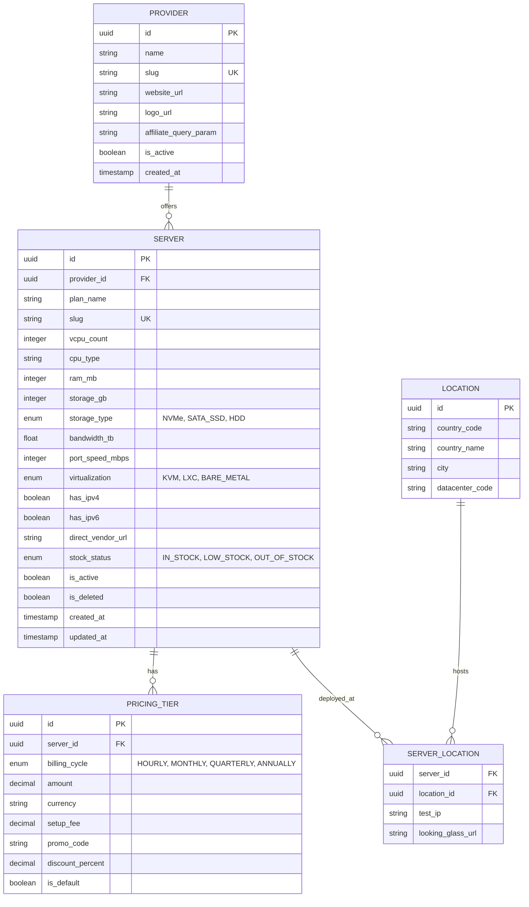

# Feature Specification: VPS Catalog & Management System

| Attribute | Value |
| :--- | :--- |
| **Specification ID** | `SPEC-001` |
| **Feature Title** | VPS Catalog with Search, Price Slider, Billing Badges, Outbound Vendor URLs, and Server CRUD |
| **Author** | Antigravity Engine / Core Team |
| **Status** | `Draft` |
| **Created Date** | 2026-10-03 |
| **Target Milestone**| v1.0.0 |
| **Directory** | `.specify/specs/` |

---

## 1. Executive Summary & Vision

The **VPS Catalog** application provides a centralized, high-performance marketplace and inventory management dashboard for discovering, comparing, and administering Virtual Private Server (VPS) hosting plans from diverse cloud providers (e.g., Hetzner, DigitalOcean, OVH, Linode, Vultr). 

The platform serves two primary user segments:
1. **Public Consumers & Engineers**: Individuals searching for hosting who need responsive faceted search, dynamic price range sliders, clear billing cycle indicators, and transparent outbound purchasing links to vendor sites.
2. **Platform Administrators**: Operators who manage VPS catalog listings through a comprehensive Create, Read, Update, and Delete (CRUD) administrative interface.

---

## 2. User Personas & User Stories

### 2.1 Personas
- **Developer Dave**: Looking for a budget KVM VPS with at least 4GB RAM located in Europe for under \$10/month.
- **Enterprise Architect Elena**: Needs high-memory, NVMe-backed instances with hourly billing and reliable network bandwidth.
- **Catalog Admin Alex**: Maintains provider partnerships, keeps server plans and pricing up to date, monitors stock status, and manages affiliate referral links.

### 2.2 User Stories
- **US-01 (Search & Filter)**: *As a developer*, I want to search VPS listings by provider name, location, and hardware specifications so that I can quickly narrow down plans that meet my infrastructure requirements.
- **US-02 (Price Filtering)**: *As a cost-sensitive buyer*, I want an intuitive dual-handle price slider with min/max bounds so that I can restrict the catalog to servers within my budget.
- **US-03 (Billing Clarity)**: *As a customer*, I want clear visual badges indicating whether a price is billed hourly, monthly, or annually, as well as setup fee notes and promotional discounts, so that I avoid hidden costs.
- **US-04 (Vendor Navigation)**: *As a prospective buyer*, I want a direct, secure outbound button to the provider's plan page so that I can configure and purchase the VPS without friction.
- **US-05 (Server Administration)**: *As a catalog administrator*, I want to create, inspect, modify, and delete/archive server plans so that the catalog remains accurate, up-to-date, and free of obsolete deals.

---

## 3. Functional Requirements

### 3.1 Search & Multi-Faceted Filtering

#### Requirements
- **F-01.1 (Full-Text Search)**: Provide a debounced (300ms) search input that queries across:
  - Provider name (e.g., "Hetzner", "DigitalOcean")
  - Plan / Instance name (e.g., "CPX21", "Droplet-General")
  - CPU model / architecture (e.g., "AMD EPYC", "ARM64", "Intel Xeon")
  - Datacenter location / country / city (e.g., "Frankfurt, DE", "Singapore")
- **F-01.2 (Hardware Facets)**: Provide multi-select filter controls for:
  - Minimum vCPU count (e.g., 1, 2, 4, 8, 16+)
  - Minimum RAM capacity (e.g., 1GB, 2GB, 4GB, 8GB, 16GB, 32GB, 64GB+)
  - Storage options: Minimum capacity slider or preset pills, and storage technology (`NVMe SSD`, `SATA SSD`, `HDD`)
  - Virtualization technology (`KVM`, `LXC`, `Dedicated / Bare Metal`)
  - Dedicated IPv4 inclusion (`Included`, `IPv6 Only`, `Optional Addon`)
- **F-01.3 (Filter State Synchronization)**:
  - All active filters must be synchronized with URL query parameters (e.g., `?q=hetzner&ram_min=4&max_price=15&billing=monthly`) enabling bookmarking and sharing.
  - Provide a "Reset All Filters" button visible whenever any non-default filter is applied.
  - Display active filter pills with a one-click removal "x" chip.

---

### 3.2 Price Range Slider

```
  Min: $2.50/mo                                       Max: $85.00/mo
  [=======|----------------------------------------------|======]
  $0.00                                                         $200.00+
```

#### Requirements
- **F-02.1 (Dual Slider Controls)**:
  - Provide a responsive dual-thumb range slider indicating both minimum and maximum price thresholds.
  - Display numerical input boxes alongside the slider for manual typing.
- **F-02.2 (Dynamic Bounds)**:
  - Automatically calculate the slider lower bound (e.g., lowest plan price in database, rounded down) and upper bound (e.g., highest plan price in database or sensible ceiling like \$250/mo).
- **F-02.3 (Normalization Across Cycles)**:
  - When filtering across mixed billing cadences, calculate a normalized monthly rate:
    $$\text{Normalized Monthly Price} = \begin{cases} \text{Hourly Rate} \times 730 & \text{if hourly only} \\ \text{Annual Rate} / 12 & \text{if annual only} \\ \text{Monthly Rate} & \text{otherwise} \end{cases}$$
  - The UI must clearly indicate that prices are normalized to a per-month equivalent when filtering.
- **F-02.4 (Performance & Debouncing)**:
  - Continuous slider dragging must update local UI text instantaneously while debouncing the query request by 200ms to eliminate server strain.

---

### 3.3 Billing Badges & Discount Indicators

#### Requirements
- **F-03.1 (Billing Cycle Badges)**:
  - Every server card must feature a distinct, color-coded badge indicating supported billing frequencies:
    - `Hourly`: Sky Blue (e.g., `$0.007/hr`)
    - `Monthly`: Emerald Green (e.g., `$4.99/mo`)
    - `Quarterly`: Indigo (e.g., `$14.50/qtr`)
    - `Annually`: Purple (e.g., `$49.00/yr`)
- **F-03.2 (Promotional & Special Badges)**:
  - `Limited Time`: Amber badge for flash sales or expiring coupons.
  - `Setup Fee`: Badge indicating either `Free Setup` or `Setup: $X.XX` if one-time charges apply.
  - `Discount Tag`: Display percentage saved for longer commitments (e.g., `Save 20% Annually`).
  - `Out of Stock`: Muted/Red badge when the server is currently unavailable for order.
- **F-03.3 (Accessibility Standards)**:
  - All badge color palettes must meet WCAG 2.1 AA contrast ratio requirements (minimum 4.5:1 against card backgrounds) and include `aria-label` screen reader descriptions.

---

### 3.4 Direct Outbound Vendor URLs

#### Requirements
- **F-04.1 (Direct Purchase Redirection)**:
  - Each server card and server detail page must include a prominent call-to-action button (e.g., "Deploy on Hetzner", "View Deal").
  - The link must point directly to the vendor's checkout or product specification page rather than generic homepages.
- **F-04.2 (Affiliate & Tracking Support)**:
  - System must support automated affiliate tag injection (e.g., appending `?ref=vpscatalog` or `&affid=1234` configured per provider).
  - Outbound clicks should trigger an asynchronous click analytics event before redirecting.
- **F-04.3 (Security & Trust Standards)**:
  - External links must specify `target="_blank"` and `rel="noopener noreferrer"`.
  - Visual external-link icon (`↗`) must accompany all vendor outbound links to notify users of external site navigation.
  - Links must be validated on creation to prevent `javascript:`, malformed URIs, or malicious redirects.

---

### 3.5 Server CRUD Operations

#### Requirements
- **F-05.1 (Create Server Listing)**:
  - Authorized users/admins can add a new server via a dedicated form or modal with validation:
    - Basic Information: Provider (dropdown selection or create new), Plan Name, Slug (auto-generated or custom).
    - Hardware Specifications: vCPU count, CPU Architecture/Model, RAM (MB or GB), Storage size & type (e.g., 50GB NVMe), Bandwidth limit (TB or Unmetered), Port speed (e.g., 1 Gbps, 10 Gbps).
    - Locations & Datacenters: Multi-select country / city list.
    - Pricing Matrix: Support multiple billing terms (hourly, monthly, yearly), currency, and setup fee.
    - Vendor URL: Primary order URL, custom affiliate query string.
    - Availability: In Stock, Out of Stock, or Retired status.
- **F-05.2 (Read & Inspect Server Listings)**:
  - **Grid View**: Compact cards optimized for browsing.
  - **Table View**: Dense comparison view with sorting on any column (Price, RAM, CPU, Storage, Bandwidth).
  - **Server Detail Modal/Page**: Complete specification sheet, network test IPs / Looking Glass links, benchmark scores (e.g., Geekbench 6), and pricing breakdowns.
- **F-05.3 (Update Server Listing)**:
  - Edit existing server details with inline validation.
  - Fast-toggle switches for `Active / Inactive` and `In Stock / Out of Stock`.
  - Timestamp tracking (`updated_at`, `last_verified_at`).
- **F-05.4 (Delete Server Listing)**:
  - Soft-delete mechanism: Marking `is_deleted = true` to preserve historical click and reference integrity.
  - Explicit confirmation modal requiring confirmation before removal.
  - Admin audit log entry generated on deletion.

---

## 4. Data Model & Architecture

### 4.1 Entity Relationship Diagram



---

## 5. REST API Specifications

### 5.1 Endpoints Overview

| Method | Endpoint | Description | Auth Required |
| :--- | :--- | :--- | :--- |
| `GET` | `/api/v1/servers` | Search and filter catalog with pagination | No |
| `GET` | `/api/v1/servers/:id` | Get detailed server plan specification | No |
| `POST` | `/api/v1/servers` | Create a new server listing | Yes (Admin) |
| `PUT` | `/api/v1/servers/:id` | Update an existing server plan | Yes (Admin) |
| `DELETE`| `/api/v1/servers/:id` | Soft delete/archive a server plan | Yes (Admin) |
| `GET` | `/api/v1/providers` | List all providers with active count | No |
| `GET` | `/api/v1/meta/filter-bounds`| Get min/max price, RAM, CPU options | No |
| `POST` | `/api/v1/servers/:id/outbound`| Record outbound click analytics & get destination | No |

### 5.2 Key Payload Examples

#### `GET /api/v1/servers` (Query Parameters)
- `q`: string (search term)
- `min_price`: decimal
- `max_price`: decimal
- `billing_cycle`: `hourly` | `monthly` | `quarterly` | `annually`
- `min_ram_mb`: integer
- `min_vcpu`: integer
- `storage_type`: `NVMe` | `SATA_SSD` | `HDD`
- `provider_ids`: comma-separated UUIDs
- `locations`: comma-separated country codes (e.g., `US,DE,SG`)
- `sort`: `price_asc` | `price_desc` | `ram_desc` | `cpu_desc` | `newest`
- `page`: integer (default 1)
- `limit`: integer (default 24)

#### Response Sample (`GET /api/v1/servers`)
```json
{
  "data": [
    {
      "id": "a3f5c71b-7a32-4d10-8b1b-298374d618fa",
      "plan_name": "CPX21",
      "slug": "hetzner-cpx21",
      "provider": {
        "id": "90e1c23a-534b-4bfe-a0e2-7634f19b1834",
        "name": "Hetzner Cloud",
        "logo_url": "https://assets.example.com/logos/hetzner.svg"
      },
      "specs": {
        "vcpu": 3,
        "cpu_type": "AMD EPYC",
        "ram_mb": 4096,
        "storage_gb": 80,
        "storage_type": "NVMe",
        "bandwidth_tb": 20.0,
        "port_speed_gbps": 10,
        "virtualization": "KVM",
        "ipv4": true,
        "ipv6": true
      },
      "locations": [
        { "code": "FSN1", "city": "Falkenstein", "country": "DE" },
        { "code": "HEL1", "city": "Helsinki", "country": "FI" },
        { "code": "ASH", "city": "Ashburn", "country": "US" }
      ],
      "pricing": [
        {
          "billing_cycle": "MONTHLY",
          "amount": 7.45,
          "currency": "EUR",
          "setup_fee": 0.00,
          "is_default": true
        },
        {
          "billing_cycle": "HOURLY",
          "amount": 0.012,
          "currency": "EUR",
          "setup_fee": 0.00,
          "is_default": false
        }
      ],
      "direct_vendor_url": "https://www.hetzner.com/cloud?ref=vpscatalog",
      "stock_status": "IN_STOCK",
      "updated_at": "2026-10-02T14:22:00Z"
    }
  ],
  "pagination": {
    "current_page": 1,
    "total_pages": 14,
    "total_records": 328,
    "limit": 24
  }
}
```

---

## 6. User Interface Design & Layout

### 6.1 Catalog Layout Wireframe

```
+----------------------------------------------------------------------------------------------------+
|  [Logo] VPS Catalog        [Search: "AMD 4GB Frankfurt..."]                  [+ Add Server] [Login]|
+----------------------------------------------------------------------------------------------------+
| FILTERS (Sidebar)             |  RESULTS (328 Servers Found)              Sort: [ Price: Low to High v ]
|                               |  Active: [Hetzner (x)] [RAM >= 4GB (x)] [Max $15/mo (x)] [Clear All]
| Price Range ($/mo)            |  +--------------------------------+ +--------------------------------+
|  Min: $3.00    Max: $15.00    |  | Hetzner Cloud        [IN STOCK]| | DigitalOcean        [IN STOCK]|
|  [====|--------------|======] |  | CPX21                          | | Basic Droplet                |
|                               |  | [Hourly] [Monthly] [Free Setup]| | [Monthly] [Save 15% Annual]  |
| Provider                      |  | ------------------------------ | | ---------------------------- |
|  [x] Hetzner        (18)      |  | 3 vCPU (AMD EPYC)              | | 2 vCPU (Intel)               |
|  [ ] DigitalOcean   (24)      |  | 4 GB RAM  |  80 GB NVMe        | | 4 GB RAM  |  50 GB SSD       |
|  [ ] OVHcloud       (31)      |  | 20 TB Bandwidth | 10 Gbps Port | | 4 TB Bandwidth | 1 Gbps Port |
|                               |  | DE, FI, US Locations           | | NYC, FRA, SGP Locations      |
| RAM (Memory)                  |  | ------------------------------ | | ---------------------------- |
|  ( ) Any   ( ) 2GB   (*) 4GB  |  | $7.45 / month                  | | $12.00 / month               |
|  ( ) 8GB   ( ) 16GB+          |  | [View Details] [Deploy Now ↗]  | | [View Details] [Deploy Now ↗]|
|                               |  +--------------------------------+ +--------------------------------+
| Storage Type                  |
|  [x] NVMe   [ ] SATA   [ ] HDD|
+----------------------------------------------------------------------------------------------------+
```

### 6.2 Key Interactive Components
1. **Search Input Bar**: Instant clear button, typeahead keyboard shortcuts (`/` to focus).
2. **Dual-Handle Slider**: Visual track fill, tooltip on hover showing current value, minimum separation enforcement.
3. **Card Badges**: Prominent pill badges placed at the top-right and sub-header of each card.
4. **Outbound Direct Link**: High-contrast button with visual external arrow indicator and immediate tab opening.
5. **Admin Drawer/Modal**: Tabbed form for Server CRUD with live preview of the server card.

---

## 7. Non-Functional Requirements

### 7.1 Performance
- **Search Latency**: Server-side faceted queries must resolve in $< 80\text{ms}$ at 95th percentile under 5,000 active plans.
- **Client Rendering**: Filter application on the client-side state must re-render the card grid in $< 16\text{ms}$ (60 FPS).
- **Asset Optimization**: Provider logos must be served in optimized SVG or WebP formats with dimension constraints.

### 7.2 Security
- **URL Sanitization**: All inbound `direct_vendor_url` entries in CRUD operations must match strict URL schemas (`https://` only, domain whitelist verification or RFC compliance).
- **Access Control (RBAC)**: Public users have Read-only access; Admin role is strictly required for Create, Update, and Delete endpoints via JWT/Session authentication.
- **Rate Limiting**: Public search endpoints limited to 120 requests/min per IP to prevent catalog scraping abuse.

### 7.3 Accessibility & Responsiveness
- Full keyboard navigation support (Tab order, Enter/Space activation, Arrow keys for range sliders).
- Mobile-first responsive layout collapsing the filter sidebar into a slide-over drawer on screens $< 1024\text{px}$.

---

## 8. Edge Cases & Error Handling

| Scenario | Expected Behavior |
| :--- | :--- |
| **No Filter Matches** | Display an engaging "No servers found matching criteria" empty state with a 1-click "Reset All Filters" CTA. |
| **Slider Min exceeds Max** | Controls enforce a minimum separation gap ($0.50) and prevent crossover of min/max handles. |
| **Broken Vendor URL** | Periodic background crawler verifies HTTP 200/301 status. If 404/500 persists, flag as `OUT_OF_STOCK` or alert admin. |
| **Currency Discrepancies** | Catalog displays original currency with automatic estimated conversion based on current daily exchange rates. |
| **Concurrent Admin Updates** | Optimistic locking using versioning or `updated_at` checks to prevent race conditions during updates. |

---

## 9. Acceptance Criteria & Test Scenarios

### Scenario 1: Search & Filter Dynamic Feedback
- **Given** the user is on the VPS catalog page with 100+ servers displayed
- **When** the user types "Hetzner" in the search bar and sets the RAM filter to "4GB"
- **Then** the catalog should filter within 300ms to show only Hetzner servers with at least 4GB RAM
- **And** the URL should update to include `?q=Hetzner&ram_min=4096` without a full page reload.

### Scenario 2: Price Range Slider Adjustment
- **Given** the price slider is set from \$0 to \$100/mo
- **When** the user drags the maximum handle down to \$15.00/mo
- **Then** all servers priced above \$15.00/mo are immediately hidden from the results
- **And** the count indicator displays the updated number of matching servers.

### Scenario 3: Billing Badges Display
- **Given** a server offers both hourly ($0.01/hr) and monthly ($6.00/mo) pricing with no setup fee
- **When** the server card renders in the catalog
- **Then** it must display a distinct `Hourly` badge and a `Monthly` badge
- **And** a `Free Setup` badge must be visible
- **And** the primary price defaults to the monthly rate.

### Scenario 4: Direct Vendor Outbound Redirection
- **Given** a server listing with a configured vendor URL and affiliate code
- **When** the user clicks "Deploy Now ↗"
- **Then** a new browser tab opens directly pointing to the vendor URL with affiliate parameters attached
- **And** the link has `rel="noopener noreferrer"` attributes.

### Scenario 5: Server CRUD Management
- **Given** an authenticated administrator is on the admin dashboard
- **When** the admin creates a new server with valid parameters and submits the form
- **Then** the server is persisted in the database and immediately searchable in the catalog
- **When** the admin selects "Delete" on an existing server and confirms the prompt
- **Then** the server is soft-deleted and no longer appears in public catalog queries.

---

## 10. Implementation Plan & Next Steps

1. **Phase 1 (Directory & Architecture)**:
   - Establish `.specify/` workspace configuration.
   - Finalize DB schema and migrations.
2. **Phase 2 (API & Admin CRUD)**:
   - Build server and provider CRUD endpoints with validation.
   - Seed sample dataset (top 50 cloud VPS providers).
3. **Phase 3 (Catalog UI & Interactions)**:
   - Implement responsive catalog layout.
   - Construct search bar, dual-handle price slider, and filter sidebar.
   - Integrate billing badges and outbound vendor tracking links.
4. **Phase 4 (Testing & Polishing)**:
   - Run end-to-end acceptance tests.
   - Verify performance benchmarks and accessibility compliance.
